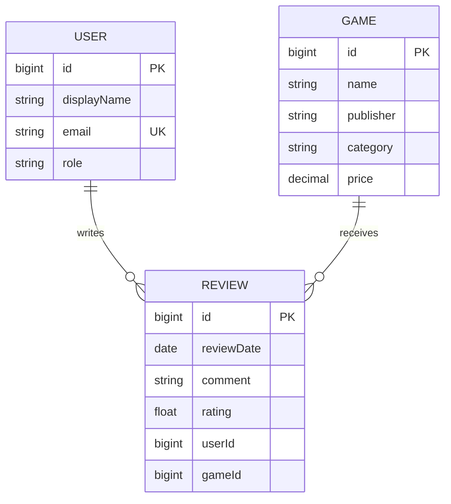

# GameReview ER Diagram

```mermaid
erDiagram
    USER ||--o{ REVIEW : writes
    GAME ||--o{ REVIEW : receives

    USER {
        bigint id PK
        string displayName
        string email UK
        string role
    }

    GAME {
        bigint id PK
        string name
        string publisher
        string category
        decimal price
    }

    REVIEW {
        bigint id PK
        date reviewDate
        string comment
        float rating
        bigint userId
        bigint gameId
    }
```

Each user can write many reviews, and each game can have many reviews. Each review belongs to one user and one game.
