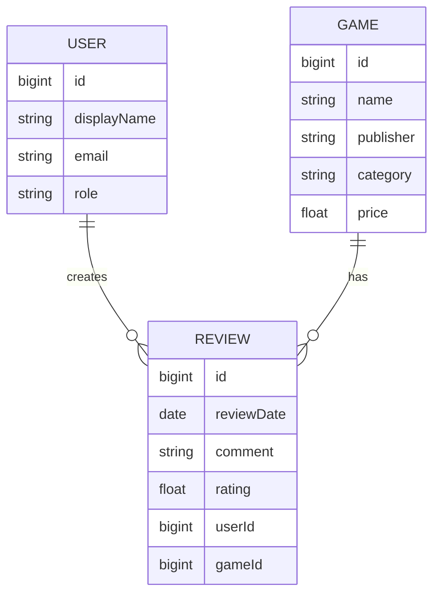

# GameReview API Proposal

## 1. The pitch (one paragraph)
Allows users to review and rate games that the admin adds, Anybody who plays video games, It would mean users could review and rate games on the client application.

## 2. Resources
| Resource | Key fields | Relationships |
|---|---|---|
| User | id, email, displayName, role | a User creates many reviews|
| Game | id, name, publisher, category, price | a Game has many reviews |
| Review | id, comment, rating, reviewDate, userId, gameId | a Review belongs to one Game and one User |

## 3. ER sketch

## 4. Endpoints
| Verb | Path | Auth | Purpose |
|---|---|---|---|
| GET | /api/v1/games | public | list all games |
| GET | /api/v1/games/{gameId} | public | get one game |
| POST | /api/v1/games | admin | add a new game |
| PATCH | /api/v1/games/{gameId} | admin | update a game |
| DELETE | /api/v1/games/{gameId} | admin | delete a game |
| GET | /api/v1/games/{gameId}/reviews | public | list reviews for one game |
| POST | /api/v1/games/{gameId}/reviews | user | create a review for a game |
| GET | /api/v1/reviews/{reviewId} | public | get one review |
| PATCH | /api/v1/reviews/{reviewId} | user | update a review |
| DELETE | /api/v1/reviews/{reviewId} | user | delete a review |
| GET | /api/v1/users/me/reviews | user | list all reviews created by the logged-in user |

## 5. Technical choices
- **Database host:**Supabase because it is easily accessible
- **OAuth2 provider:** Google
- **Repo layout:** Split because it will make sure we are only touching one component at a time.

## 6. Risks
Google OAuth is going to be new to everyone. I would assume that something is going to go wrong, especially on how to determine what the users role will be if they login through email.
The relationship between reviews and games/users is slightly different because they can both have many reviews but each review can only have one game and one user.

## 7. Team and Sprint 1
https://github.com/users/thomas-gonda/projects/1/views/1
Issue #2 Anthony https://github.com/thomas-gonda/CST438Project2/issues/2
Issue #5 Caleb https://github.com/thomas-gonda/CST438Project2/issues/5
Issue #8 Daniel https://github.com/thomas-gonda/CST438Project2/issues/8
Issue #11 Thomas https://github.com/thomas-gonda/CST438Project2/issues/11